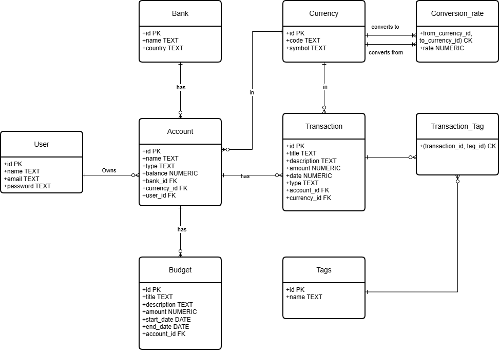

# Design Document

By Juan David Toro Velez a.k.a @crozzdev

Video overview: <URL HERE>

## Scope

In this section you should answer the following questions:

The purpose of this database is to represent transactions, budgets, and accounts for a personal finance application in multiple currencies. The database will allow users to track their income and expenses, set budgets or pockets, and manage their financial accounts. As such, included in the database's scope is:

- Transactions, including the amount, date, category, and associated account
- Budgets, including the amount, date range, and associated account
- Accounts, including the name, type, and balance
- Banks associated with accounts, including the bank name and country
- Currencies associated with accounts, including the currency code and symbol

Out of scope are elements like investment tracking, credit scores, and other non-core attributes.

## Functional Requirements

This database will support :

- CRUD operations for transactions, budgets, and accounts.
- Tracking all versions of transactions, including multiple transactions for the same account
- Adding multiple budgets to an account

At this iteration, the system will not support users creating sub-accounts, tracking investments or credit scores. Also the conversion rates for different currencies will be fixed and not updated in real time, as the focus of this database is on representing transactions, budgets, and accounts rather than providing real-time currency conversion. I am also only coverying only USD, EUR, and COP as the supported currencies, given that these are the most commonly used currencies among the target user base for this application.

## Representation

### Entities

In this section you should answer the following questions:

The database includes the following entities:

#### Users

The `users` table includes:

- `id`, which specifies the unique ID for the user as an `INTEGER`. This column thus has the `PRIMARY KEY` constraint applied.
- `name`, which specifies the name of the user as `TEXT`.
- `email`, which specifies the email of the user as `TEXT`. A `UNIQUE` constraint ensures no two users have the same email.
- `password`, which specifies the password of the user as `TEXT`. In production, this should be stored as a hashed value for security reasons, but for the sake of simplicity in this design, it is stored as plain text.

#### Banks

The `banks` table includes:

- `id`, which specifies the unique ID for the bank as an `INTEGER`. This column thus has the `PRIMARY KEY` constraint applied.
- `name`, which specifies the name of the bank as `TEXT`. This has the `UNIQUE` constraint so we avoid having two banks with the same name.
- `country`, which specifies the country of the bank as `TEXT`.

All the columns in the `banks` table are required and hence should have the `NOT NULL` constraint applied. No other constraints are necessary.

#### Currencies

The `currencies` table includes:

- `id`, which specifies the unique ID for the currency as an `INTEGER`. This column thus has the `PRIMARY KEY` constraint applied.
- `code`, which specifies the currency code as `TEXT`, such as USD, EUR, COP. A `UNIQUE` constraint ensures no two currencies have the same code.
- `symbol`, which specifies the currency symbol as `TEXT`, such as $, €, or ₩. A `UNIQUE` constraint ensures no two currencies have the same symbol.

All the columns in the `currencies` table are required and hence should have the `NOT NULL` constraint applied. No other constraints are necessary.

#### Currency Conversion Rates

The `currency_conversion_rates` table serves as a junction table to associate currencies with their conversion rates:

- `from_currency_id`, which specifies the ID of the source currency as an `INTEGER`, with a `FOREIGN KEY` constraint referencing the `currencies` table to maintain referential integrity.
- `to_currency_id`, which specifies the ID of the target currency as an `INTEGER`, with a `FOREIGN KEY` constraint referencing the `currencies` table to maintain referential integrity
-(`from_currency_id`, `to_currency_id`), which specifies the IDs of the source and target currencies as `INTEGER`s, they serve as a composite `PRIMARY KEY` to ensure that there is only one conversion rate for each pair of currencies.
- `rate`, which specifies the conversion rate as a `NUMERIC (10, 6)`, given that conversion rates can involve decimal values. This also must no be less than or equal to zero, as indicated by the `CHECK (rate > 0)` constraint.

#### Tags

The `tags` table includes:

- `id`, which specifies the unique ID for the tag as an `INTEGER`. This column thus has the `PRIMARY KEY` constraint applied.
- `name`, which specifies the name of the tag as `TEXT`. A `UNIQUE` constraint ensures no two tags have the same name. Also the `NOT NULL` constraint is applied to ensure that every tag has a name.

#### Transaction Tags

The `transaction_tags` table serves as a junction table to associate transactions with tags:

- `transaction_id`, which specifies the ID of the associated transaction as an `INTEGER`, with a `FOREIGN KEY` constraint referencing the `transactions` table to maintain referential integrity.
- `tag_id`, which specifies the ID of the associated tag as an `INTEGER`, with a `FOREIGN KEY` constraint referencing the `tags` table to maintain referential integrity.
- (`transaction_id`, `tag_id`), which specifies the IDs of the associated transaction and tag as `INTEGER`s, they serve as a composite `PRIMARY KEY` to ensure that each transaction can only be associated with a specific tag once.

#### Accounts

The `accounts` table includes:

- `id`, which specifies the unique ID for the account as an `INTEGER`. This column thus has the `PRIMARY KEY` constraint applied.
- `name`, which specifies the name of the account as `TEXT`.
- `type`, which specifies the type of the account as `TEXT`, allowing for flexible categorization to indicate whether the account is a checking, savings, credit card. We check that the value of this column is either one of the previous values using the `CHECK (type IN ('savings', 'checking','credit card'))` constraint.
- `balance`, which specifies the balance of the account as a `NUMERIC (10, 2)`, given that account balances can involve decimal values. It must be greater than or equal to zero, as indicated by the `CHECK (balance >= 0)` constraint.
- `bank_id`, which specifies the ID of the associated bank as an `INTEGER`, with a `FOREIGN KEY` constraint referencing the `banks` table to maintain referential integrity.
- `currency_id`, which specifies the ID of the associated currency as an `INTEGER`, with a `FOREIGN KEY` constraint referencing the `currencies` table to maintain referential integrity.
- `user_id`, which specifies the ID of the associated user as an `INTEGER`, with a `FOREIGN KEY` constraint referencing the `users` table to maintain referential integrity.

All columns in the `accounts` table are required and hence should have the `NOT NULL` constraint applied where a `PRIMARY KEY` or `FOREIGN KEY` constraint is not. Other constraint needed is the `UNIQUE` at table level for `name` and `user_id` to ensure that a user cannot have two accounts with the same name.

#### Transactions

The `transactions` table includes:

- `id`, which specifies the unique ID for the transaction as an `INTEGER`. This column thus has the `PRIMARY KEY` constraint applied.
- `title`, which specifies the title of the transaction as `TEXT`. This must not be null, as indicated by the `NOT NULL` constraint, to ensure that every transaction has a title.
- `description`, which specifies the description of the transaction as `TEXT`, allowing for a more detailed explanation of the transaction. This can be optional, as not every transaction may require a description, so it does not have the `NOT NULL` constraint applied.
- `amount`, which specifies the amount of the transaction as a `NUMERIC (10, 2)`, given that transactions can involve decimal values. It must be greater than zero, as indicated by the `CHECK (amount > 0)` constraint, to ensure that transactions have a positive amount.
- `date`, which specifies the date of the transaction as `NUMERIC`, given that SQLite can store timestamps as numeric values. The default value for the `date` attribute is the current timestamp, as denoted by `DEFAULT CURRENT_TIMESTAMP`.
- `type`, which specifies the type of the transaction as `TEXT`, allowing for flexible categorization to indicate whether the transaction is an income or an expense. We check that the value of this column is either 'income' or 'expense' using the `CHECK (type IN ('income', 'expense'))` constraint.
- `account_id`, which specifies the ID of the associated account as an `INTEGER`, with a `FOREIGN KEY` constraint referencing the `accounts` table to maintain referential integrity.
- `currency_id`, which specifies the ID of the associated currency as an `INTEGER`, with a `FOREIGN KEY` constraint referencing the `currencies` table to maintain referential integrity.

#### Budgets

The `budgets` table includes:

- `id`, which specifies the unique ID for the budget as an `INTEGER`. This column thus has the `PRIMARY KEY` constraint applied.
- `title`, which specifies the title of the budget as `TEXT`.This must not be null, as indicated by the `NOT NULL` constraint, to ensure that every budget has a title and `UNIQUE` so we don't have more than one budget with the same name.
- `description`, which specifies the description of the budget as `TEXT`, allowing for a more detailed explanation of the budget. This can be optional, as not every budget may require a description, so it does not have the `NOT NULL` constraint applied.
- `amount`, which specifies the amount of the budget as a `NUMERIC (10, 2)`, given that budgets can involve decimal values.I also check that the amount is greater than zero using the `CHECK (amount > 0)` constraint, to ensure that budgets have a positive amount.
- `start_date`, which specifies the start date of the budget as `NUMERIC`, given that SQLite can store timestamps as numeric values. The default value for the `start_date` attribute is the current timestamp, as denoted by `DEFAULT CURRENT_TIMESTAMP`.
- `end_date`, which specifies the end date of the budget as `NUMERIC`, given that SQLite can store timestamps as numeric values. This cannot be null or less than the `start_date`, as indicated by the `NOT NULL` and `CHECK (end_date >= start_date)` constraints.
- `account_id`, which specifies the ID of the associated account as an `INTEGER`, with a `FOREIGN KEY` constraint referencing the `accounts` table to maintain referential integrity.

### Relationships

The below entity relationship diagram describes the relationships among the entities in the database.

As detailed by the diagram:

- A transaction belongs to one account, and an account can have many transactions.
- A transaction also belongs to one currency, and a currency can be associated with many transactions.
- A transaction can have many tags, and a tag can be associated with many transactions through the `transaction_tags` junction table.
- A budget also belongs to one account, and an account can have many budgets. The currency for the budget is determined by the account's currency.
- An account belongs to one bank, and a bank can have many accounts.
- An account also belongs to one currency, and a currency can be associated with many accounts.
- A currency conversion rate is defined for a pair of currencies, and each currency can have many conversion rates to other currencies through the `currency_conversion_rates` junction table.
- A transaction may be recorded in a currency different from its account's base currency. The conversion rate table is used to resolve the balance update. Budgets, however, are always denominated in the account's currency.
- Finally, a user can have many accounts, but an account belongs to only one user.

## Optimizations

In this section you should answer the following questions:

- Which optimizations (e.g., indexes, views) did you create? Why?

## Limitations

- The current scheme does not support tracking of the balance of the account when creating budgets or transactions, which means that the balance of the account will not be updated when a new transaction or budget is created. For this, the proposed solution is to create triggers that update the balance of the account whenever a new transaction or budget is created, updated, or deleted. This would ensure that the balance of the account is always accurate and up-to-date.

- Implementing this database in a more robust RDBMS like PostgreSQL would allow for more complex constraints and data types, such as a dedicated date type for the `date`, `start_date`, and `end_date` attributes, which would improve data integrity and make it easier to perform date-related queries. Additionally, it would also implement the ACID properties more robustly, which would permit transactions to happen that solve the issue of keeping the account balance up to date when creating, updating, or deleting transactions and budgets.

- Finally, as already mentioned in the scope, the database does not support real-time currency conversion, which means that the conversion rates for different currencies will be fixed and not updated in real time. This is a limitation because currency conversion rates can fluctuate frequently, and having fixed rates may not accurately reflect the current value of transactions and budgets in different currencies. A potential solution to this limitation would be to integrate an external API in the application layer that provides real-time currency conversion rates, allowing the database to update the conversion rates automatically and ensure that the values of transactions and budgets are always accurate.

thanks, can you please generate some sample data:

First, let's add two users: Juan and Natalia, emails: <juan@example.com> and <natalia@example.com>, passwords: example_1, example_2

Secondly, let's add three banks: RappiPay , country: Colombia, Davivienda, country: Colombia and Bank of America: USA

Third, let's add three tags: salary, food, travel

Fourth, let's add three currencies: COP, EURO, US Dollar

Fifth, in the conversion rate table let's add the conversion rate for each combination of the currency with the rates as of today

Sixth, Juan has had t transactions so far, one in January and other in February, the one in january was 9M COP type income, and the same in February,
